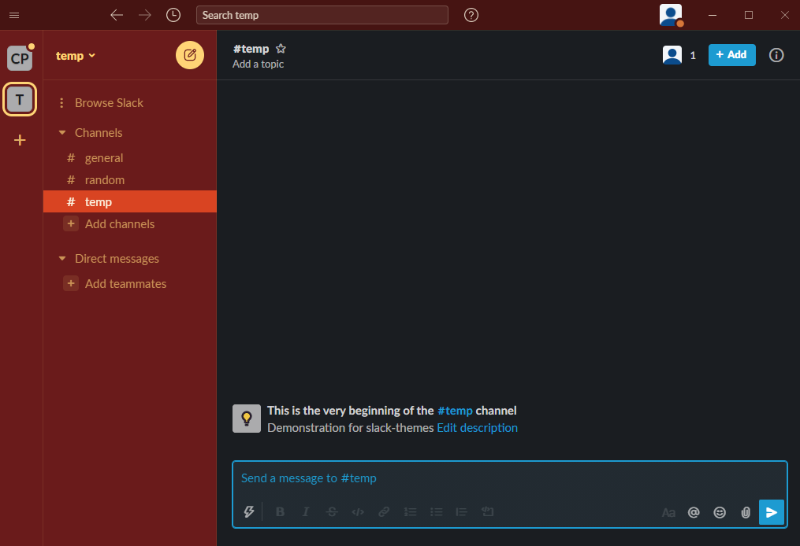

# slack-themes
A list of slack themes for users to customize Slack.

The eventual goal of this repository is for all users to be able to add their custom themes here to make them available for others to use.

## How to Use

Instructions for Mac

1. Go to _Slack > Preferences_
2. Click on _Themes_ from the left nav-bar
3. Scroll to find the _Create a custom theme_ link. This should open a section to set the colors in the theme. (This step may not be needed if you have already expanded this section)
4. Copy the hex values from one of the themes below and paste them in the large text box which under the text `Copy and paste these values to share your custom theme with others`. This should change the theme of the Slack window

Instructions for Windows

1. Click _the 3 bars on the top left corner > File > Preferences (alternatively use the ctrl+, keyboard shortcut)_
2. Click on _Themes_ from the left nav-bar
3. Scroll down until you find the _**Colors** Custom theme_ section. There you should find a 3x3 matrix with hex values corresponding to different parts of Slack. Below them you will find the text `Copy and paste these values to share your custom theme with others`, along with a large text box
4. Copy the hex values from one of the themes below and paste them in the large text box. This should change the theme of the Slack window

## Custom Themes


## Default Slack Themes

1. Aubergine

  ```
  #3F0E40,#350d36,#1164A3,#FFFFFF,#350D36,#FFFFFF,#2BAC76,#CD2553,#350d36,#FFFFFF
  ``` 
  <details><summary>Click here for screenshot</summary>
  
  </details>

2. Ochin

  ```
  #303E4D,#2C3849,#6698C8,#FFFFFF,#4A5664,#FFFFFF,#94E864,#78AF8F,#2C3849,#FFFFFF
  ``` 
  <details><summary>Click here for screenshot</summary>
  
  </details>

3. Monument

  ```
  #0D7E83,#076570,#F79F66,#FFFFFF,#D37C71,#FFFFFF,#F79F66,#F15340,#076570,#FFFFFF
  ``` 
  <details><summary>Click here for screenshot</summary>
  
  </details>

4. Work Hard

  ```
  #4D5250,#444A47,#D39B46,#FFFFFF,#434745,#FFFFFF,#99D04A,#DB6668,#444A47,#FFFFFF
  ```
  <details><summary>Click here for screenshot</summary>
  
  </details>

5. Aubergine Classic

  ```
  #4D394B,#3E313C,#4C9689,#FFFFFF,#3E313C,#FFFFFF,#38978D,#EB4D5C,#3E313C,#FFFFFF
  ```
  <details><summary>Click here for screenshot</summary>
  
  </details>

6. Eggplant

  ```
  #FBFAF7,#DCEEE4,#4A154B,#FBFAF7,#DCEEE4,#4A154B,#2BAC76,#BD3855,#4A154B,#FFFFFF
  ```
  <details><summary>Click here for screenshot</summary>
  
  </details>

7. Hoth

  ```
  #F8F8FA,#F8F8FA,#2D9EE0,#FFFFFF,#FFFFFF,#383F45,#60D156,#DC5960,#F8F8FA,#383F45
  ```
  <details><summary>Click here for screenshot</summary>
  
  </details>

8. Mondrain

  ```
  #FFFFFF,#FFC806,#000000,#FFFFFF,#FFC806,#000000,#000000,#FD0B00,#1F57E7,#FFFFFF
  ```
  <details><summary>Click here for screenshot</summary>
  
  </details>

9. Ultraviolet

  ```
  #F5F5F5,#F0F0F0,#6715EB,#FFFFFF,#E8E8E8,#1A1A1A,#6715EB,#CD2553,#6715EB,#FFFFFF
  ```
  <details><summary>Click here for screenshot</summary>
  
  </details>

10. Mood Indigo

  ```
  #F8F8FA,#E0E7FF,#001A5E,#F8F8FA,#E0E7FF,#001A5E,#2153FF,#2153FF,#001A5E,#FFFFFF
  ```
  <details><summary>Click here for screenshot</summary>
  
  </details>

11. CMYK

  ```
  #F2F4F7,#FFE600,#35C2FF,#FFFFFF,#FFE600,#151834,#35C2FF,#E71FA3,#E71FA3,#FFFFFF
  ```
  <details><summary>Click here for screenshot</summary>
  
  </details>

12. Nocturne

  ```
  #1A1D21,#000000,#0576B9,#FFFFFF,#000000,#FFFFFF,#39E500,#CC4400,#000000,#FFFFFF
  ```
  <details><summary>Click here for screenshot</summary>
  
  </details>

13. Haberdashery

  ```
  #073642,#002B36,#7D6005,#FDF6E3,#002B36,#FDF6E3,#55D44E,#DC322F,#002B36,#FDF6E3
  ```
  <details><summary>Click here for screenshot</summary>
  
  </details>

14. Expensive

  ```
  #1A1D21,#232527,#3E4232,#C9C49C,#232527,#C9C49C,#C9C49C,#3E4233,#C9C49C,#1A1D21
  ```
  <details><summary>Click here for screenshot</summary>
  
  </details>

15. Terminal

  ```
  #1A1D21,#1A2B23,#4EE077,#1A1D21,#1A2B23,#4EE077,#4EE077,#1C913D,#1A2B23,#4EE077
  ```
  <details><summary>Click here for screenshot</summary>
  
  </details>

16. Sweet Treat

  ```
  #FFEEED,#FFC2C0,#FFC2C0,#4A154B,#FFFFFF,#4A154B,#FFA95A,#37BD8D,#FFC2C0,#4A154B
  ```
  <details><summary>Click here for screenshot</summary>
  
  </details>

17. Banana

  ```
  #FFEB84,#FFF8D4,#FFC806,#591035,#FFF8D4,#591035,#4C6DC2,#DD4147,#FFC806,#591035
  ```
  <details><summary>Click here for screenshot</summary>
  
  </details>

18. Choco Mint

  ```
  #544538,#42362B,#5DB09D,#FFFFFF,#4A3C30,#FFFFFF,#FFFFFF,#5DB09D,#42362B,#FFFFFF
  ```
  <details><summary>Click here for screenshot</summary>
  
  </details>

19. Discotheque

  ```
  #6A1B1B,#6A1B1B,#D94422,#FDF6E3,#461412,#FFD476,#D67739,#D94422,#461412,#FDF6E3
  ```
  <details><summary>Click here for screenshot</summary>
  
  </details>

20. Tritanopia

  ```
  #4F2F4C,#452842,#8C5888,#FFFFFF,#1C0B1A,#FFFFFF,#00FFB7,#DE4C0D,#452842,#FFFFFF
  ```
  <details><summary>Click here for screenshot</summary>
  
  </details>

21. Protanopia & Deuteranopia

  ```
  #4F2F4C,#452842,#8C5888,#FFFFFF,#1C0B1A,#FFFFFF,#D0FF00,#889100,#452842,#FFFFFF
  ```
  <details><summary>Click here for screenshot</summary>
  
  </details>

## Contributing

Follow [these guidelines](https://github.com/sachinh19/slack-themes/blob/main/CONTRIBUTING.md) to  contribute

If you see a mistake in any part of this repository, report a bug and send a PR if you can. Since this is a text and image only repository the bug report can be as simple as a typo or grammatical mistakes or formatting issues. Bugs will also be accepted for flagging/deleting existing repository content that is found to be inappropriate.

## License

This repository is [MIT Licensed](https://github.com/sachinh19/slack-themes/blob/main/LICENSE)
